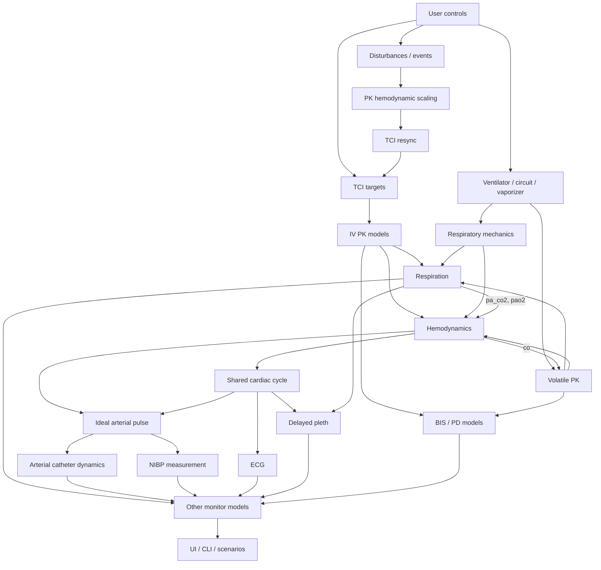

# AnaSim architecture

## Overview

AnaSim separates pharmacology, cardiorespiratory physiology, ventilation, and
monitor simulation into stateful subsystems. The runtime advances them in a
fixed order and projects their outputs into `SimulationState`.

## State contract

`SimulationState` separates physiologic state, ideal arterial pulse landmarks,
and monitor measurements:

| Layer | Fields | Meaning |
|------|--------|---------|
| Physiology | `map`, `hr`, `co`, `sv`, `svr`, `sao2`, `pa_co2`, `alveolar_co2`, `pao2` | Source values used by physiology, analytics, and safety logic |
| Ideal arterial pulse | `sbp`, `dbp` | Beat-latched landmark pressures derived from Su MAP and stroke volume |
| Arterial catheter | `art_pressure`, `art_sbp`, `art_dbp`, `art_map` | Instantaneous and completed-beat values after fluid-filled line dynamics |
| Other monitor outputs | `nibp_sys`, `nibp_dia`, `nibp_map`, `display_hr`, `display_bis`, `display_etco2`, `display_spo2` | Learner-facing measurements produced by their monitor models |

State access rules:

- `state.map/hr/sv/co/svr` store Su outputs. The arterial renderer reads these
  values downstream.
- `state.sbp/dbp` store ideal pulse landmarks. NIBP synthesis reads them with
  `state.map`.
- The UI, CLI, alarms, and scenarios read `art_*` when the arterial line is
  enabled and `nibp_*` in cuff mode.
- The recorder writes physiology and monitor measurements to reproduce the
  displayed state.
- Projection and monitor boundaries convert public numeric fields to Python
  `float` values.

## Module structure

```text
AnaSim/
├── core/               # Simulation engine and control
│   ├── engine.py       # Facade/state container
│   ├── initialization.py # Startup target solving and subsystem seeding
│   ├── runtime.py      # Step orchestration
│   ├── projection.py   # Subsystem -> SimulationState projection
│   ├── monitors.py     # Monitor orchestration, NIBP, capno, alarms
│   ├── tci.py          # Target-Controlled Infusion controllers
│   ├── state.py        # Simulation state dataclasses
│   ├── action_log.py   # Timestamped control actions and scenario step activations
│   ├── recorder.py     # CSV recorder
│   └── utils.py        # Shared utility functions
├── patient/            # Patient demographics and PK/PD models
│   ├── patient.py
│   ├── pk_models.py
│   ├── pd/
│   │   ├── anesthesia.py
│   │   └── nmba.py
│   └── volatile_pk.py
├── physiology/         # Hemodynamics, respiration, disturbances
│   ├── hemodynamics.py
│   ├── respiration.py
│   ├── resp_mech.py
│   └── disturbances.py
├── monitors/           # Monitor waveforms and alarms
│   ├── cardiac_cycle.py # Shared ECG, ART, and pleth beat clock
│   ├── arterial.py     # Ideal arterial pulse and catheter dynamics
│   ├── ecg.py
│   ├── capno.py
│   ├── nibp.py
│   ├── spo2.py
│   └── alarms.py
├── ui/                 # PySide UI
└── scripts/            # Utilities, including run_benchmarks.py
```

## Step pipeline

```text
SimulationEngine.step()
1. Disturbances and user-triggered events
2. PK hemodynamic scaling from current blood volume and CO
3. Active TCI controller resynchronization to live PK state
4. TCI controller updates -> infusion rates
5. Machine state update (ventilator, bag-mask, vaporizer, circuit)
6. PK model update -> Ce/Cp and volatile tissue states
7. Physiology update
   a. Respiratory mechanics
   b. Respiration / gas exchange
   c. Hemodynamics
8. Projection -> subsystem physiology copied into `SimulationState`
9. Monitor synthesis
   a. Shared cardiac cycle
   b. Ideal arterial pulse from Su MAP and stroke volume
   c. Arterial catheter dynamics, ECG, and delayed pleth
   d. NIBP, capnography, other display values, and alarms
10. Shivering update
11. Temperature update
12. Death detector
```

Pipeline ownership:

- `runtime.step_physiology()` computes physiologic output.
- `projection.project_runtime_physiology()` writes raw physiologic fields into `SimulationState`.
- `monitors.step_monitors()` reads projected physiology and writes waveforms and
  monitor fields.

## Dependency graph



## Inputs by subsystem

### Hemodynamics

| Source | Data | Notes |
|--------|------|-------|
| PK Propofol | `propofol_cp` | Vasodilation, cardiac depression |
| PK Remifentanil | `remi_cp` | Bradycardia, vasodilation |
| Vasopressor PK | `nore_ce`, `epi_ce`, `phenyl_ce`, `vaso_ce`, `dobu_ce`, `mil_ce` | Vasoconstriction, inotropy, lusitropy |
| Volatile PK | `mac_sevo` | Cardiovascular depression |
| Resp mechanics | `pit`, `peep_cmH2O` | Preload and pulmonary coupling |
| Respiration | `pa_co2`, `pao2` | Chemoreflex and hypoxia effects |
| Disturbances | `d_hr`, `d_sv`, `d_svr` | Surgical stimulation |

### Respiration

| Source | Data | Notes |
|--------|------|-------|
| PK Propofol | `propofol_ce` | Depresses central drive |
| PK Remifentanil | `remi_ce` | Depresses drive and CO2 response |
| PK Rocuronium | `roc_ce` | Reduces muscle factor |
| Volatile PK | `mac_sevo` | Depresses ventilatory control |
| Resp mechanics | delivered VT, mean Paw, PEEP | Assisted ventilation and oxygenation |
| Hemodynamics | `co` (from prior step) | Influences perfusion-sensitive EtCO2 behavior |
| Thermal/shivering | metabolic factor, shiver level | Alters VCO2 and O2 demand |

### Monitor layer

| Source | Data | Notes |
|--------|------|-------|
| Hemodynamics | `map`, `hr`, `sv` | Drives the shared beat clock and ideal arterial pulse |
| Ideal arterial pulse | `sbp`, `dbp`, instantaneous pressure | Landmarks feed NIBP; the waveform feeds the arterial catheter |
| Arterial catheter | filtered pressure and completed-beat `art_*` | Drives the ART trace, numerics, and MAP alarm when enabled |
| Respiration | raw `etco2`, `sao2` | Used to synthesize capno and pulse oximetry behavior |
| BIS / TOF / LOC | raw model outputs | Displayed and alarmed values |
| Monitor settings | arterial line enabled, NIBP interval | Changes presentation mode |

## Cross-step inputs

The fixed execution order carries these inputs from the preceding step:

| Value | Used by | Updated by | Reason |
|------|---------|------------|--------|
| `state.co` | Volatile PK scaling and respiration perfusion effects | Hemodynamics | Hemodynamics runs after PK and respiration |
| `state.va` | Volatile PK | Respiration | Respiration runs after machine and PK setup |
| `state.mv` | Circuit and machine context | Physiology | Physiology finalizes minute ventilation after mechanics and respiration |

Each value is delayed by one configured simulation step.

## State synchronization examples

```text
pk_prop.state.ce      -> state.propofol_ce
pk_prop.state.c1      -> state.propofol_cp
pk_remi.state.ce      -> state.remi_ce
pk_remi.state.c1      -> state.remi_cp
resp_state.pa_co2     -> state.pa_co2
resp_state.p_alveolar_co2 -> state.alveolar_co2
hemo_state.map        -> state.map
hemo_state.map/sv     -> state.sbp/dbp       (ideal pulse renderer)
ideal pulse pressure  -> state.art_pressure  (catheter dynamics)
completed ART beat    -> state.art_sbp/art_dbp/art_map
spo2_monitor output   -> state.spo2
spo2_monitor output   -> state.display_spo2
```

## Initialization

Initialization runs before the visible simulation loop:

- `awake` initializes from patient baselines.
- `steady_state` runs a controlled-maintenance bootstrap to initialize drug,
  gas, fluid, and physiologic state. Recording, display history, death checks,
  and visible fluid and temperature accounting begin after the bootstrap.
- Visible time starts at zero. Norepinephrine used to reach the initial MAP
  target remains active and visible.
- Early drift can occur as controllers, gases, and fluid balance continue from
  the bootstrap.

## Model notes

### Hemodynamics

- The hemodynamic model extends Su et al. 2023 with volume, pulmonary,
  vasoactive, septic shock, and anaphylaxis effects.
- Propofol and remifentanil cardiovascular effects consume plasma concentrations (`propofol_cp`, `remi_cp`); CNS depth, tolerance, BIS, and respiratory depression consume effect-site values (`propofol_ce`, `remi_ce`).

### Respiration

- Central drive is depressed by propofol, remifentanil, and sevoflurane.
- A rocuronium-dependent muscle factor represents neuromuscular weakness.
- The respiratory model tracks `alveolar_co2`, `pa_co2`, and `etco2`
  separately.
- Low cardiac output widens the PaCO2-EtCO2 gap; arterial `sao2` remains tied to PaO2 and hemoglobin dissociation.

### Monitors

- ECG, arterial pressure, and pleth use one beat clock. Arterial ejection follows the QRS, and pleth follows arterial pressure after a peripheral delay.
- Beat-synchronous monitor models advance internally at intervals of 10 ms or less, independent of the outer physiology step.
- Su controls hemodynamics. The arterial renderer shapes each beat with the
  systolic, diastolic, dicrotic-notch, and dicrotic-peak landmarks described by
  Mahdi et al. Beat mean equals Su MAP, and pulse pressure derives from Su stroke
  volume and age-adjusted arterial compliance.
- The arterial catheter applies configurable second-order measurement dynamics. The default natural frequency is 20 Hz and damping ratio is 0.65.
- ART numerics come from completed filtered beats. NIBP measures the same ideal systolic, diastolic, and mean pressures with cuff timing, bias, and failure behavior.
- Monitor HR is beat-derived. BIS uses time-step-aware smoothing.
- Poor perfusion slows finger SpO2 and reduces pleth amplitude. Raw arterial
  saturation remains tied to PaO2 and hemoglobin dissociation.
- EtCO2 numerics update from completed capnogram breaths. The display clears 15
  seconds after the last valid exhaled sample.
- Unorganized arrest rhythms suppress the arterial pulse and pleth while ECG retains its rhythm-specific trace.

### TCI

Controllers rebuild after PK parameter changes and reseed after external boluses.

## Scenario objectives

`engine.actions` records controls and event transitions with simulation times.
The scenario overlay calls `begin_step()` when an objective becomes active.

Objectives fall into two kinds:

| Kind | Example | Check reads |
|------|---------|-------------|
| Action | "Give 500 mL", "start the vasopressor", "select the ETT" | `engine.actions` since the objective activated, plus current state when relevant |
| State / physiologic | "MAP > 65", "TOF below 25%", "circuit FiO2 below 30%" | Current engine state |

An action objective reads actions recorded after its activation. Earlier actions
remain outside the objective's log range.

Step scoping uses log positions because paused actions can share a timestamp.
Step-scoped queries require an active objective.
