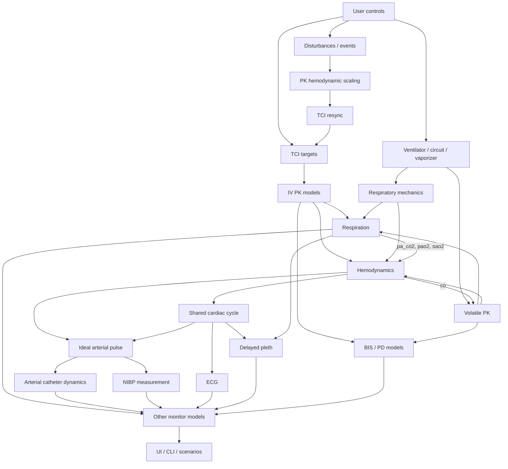

# AnaSim architecture

AnaSim splits pharmacology, cardiorespiratory physiology, the anesthesia
machine, and monitors into stateful subsystems. The runtime advances them in a
fixed order and projects their outputs into `SimulationState`.

## State contract

`SimulationState` keeps physiology, ideal arterial pulse landmarks, and monitor
measurements separate:

| Layer | Fields | Meaning |
|-------|--------|---------|
| Physiology | `map`, `hr`, `co`, `sv`, `svr`, `sao2`, `pa_co2`, `alveolar_co2`, `pao2` | Model values used by physiology, analytics, and endpoints |
| Ideal arterial pulse | `sbp`, `dbp` | Beat landmarks derived from Su MAP and stroke volume |
| Arterial catheter | `art_pressure`, `art_sbp`, `art_dbp`, `art_map` | Instantaneous and completed-beat values after line dynamics |
| Other monitors | `nibp_sys`, `nibp_dia`, `nibp_map`, `display_hr`, `display_bis`, `display_etco2`, `display_spo2` | Values shown to the learner |

- `map`, `hr`, `sv`, `co`, and `svr` are Su model outputs. Monitors read them
  and never write them.
- NIBP measures `sbp`, `dbp`, and `map`.
- The UI, CLI, alarms, and scenarios read `art_*` when the arterial line is
  enabled and `nibp_*` otherwise.
- The recorder writes both physiology and monitor values.
- `engine.output_buffer` holds ten seconds of per-step `WaveformSample` records
  (ECG, pleth, capnogram, arterial pressure) for the monitor sweep.
- Public numeric fields are built-in `float` values.

## Modules

```text
anasim/
├── cli.py                  # Desktop and headless entry point
├── core/
│   ├── engine.py           # SimulationEngine: subsystems and learner controls
│   ├── runtime.py          # Step order
│   ├── initialization.py   # Awake and steady-state startup
│   ├── projection.py       # Subsystem state -> SimulationState
│   ├── monitors.py         # Monitor stepping, NIBP, capnography, alarms
│   ├── state.py            # SimulationConfig and SimulationState
│   ├── drug_registry.py    # Drug units, rate limits, and UI metadata
│   ├── drug_api.py         # Infusion and TCI controls
│   ├── tci.py              # TCI controller
│   ├── action_log.py       # Learner actions and scenario objectives
│   └── recorder.py         # CSV recording
├── patient/
│   ├── patient.py          # Demographics, hematology, organ function
│   ├── domain.py           # Supported input ranges
│   ├── pk_models.py        # Intravenous PK
│   ├── volatile_pk.py      # Inhaled agent uptake
│   └── pd/                 # BIS, LOC, tolerance, neuromuscular block
├── physiology/
│   ├── hemodynamics.py     # Extended Su model
│   ├── hemo_config.py      # Hemodynamic parameters
│   ├── respiration.py      # Ventilatory control and gas exchange
│   ├── resp_mech.py        # Airway pressure, flow, and volume
│   └── disturbances.py     # Stimulation profiles
├── machine/                # Circle system, ventilator, vaporizer
├── monitors/               # Cardiac cycle, ECG, arterial line, SpO2, NIBP, capnography, alarms
└── ui/                     # PySide6 interface and guided scenarios
```

`scripts/` holds the README demo capture and a benchmark runner.

## Step order

```text
SimulationEngine.step()
 1. Anesthetic depth, metabolic rate, and tolerance of stimulation
 2. Disturbances and clinical events
 3. PK scaling to blood volume and CO; resynchronize active TCI
 4. TCI infusion rates
 5. Machine: ventilator, bag-mask, vaporizer, circuit
 6. PK: plasma and effect-site concentrations, TOF, volatile uptake
 7. Physiology: respiratory mechanics, gas exchange, hemodynamics
 8. Projection into SimulationState
 9. Monitors: cardiac cycle, arterial pulse and line, ECG, pleth, NIBP,
    capnography, alarms
10. Shivering
11. Temperature
12. Cardiac arrest check
```

- `runtime.step_physiology()` computes physiology.
- `projection.project_runtime_physiology()` writes it into `SimulationState`.
- `monitors.step_monitors()` reads the projected physiology and writes
  waveforms and monitor fields.

## Dependency graph



## Inputs by subsystem

### Hemodynamics

| Source | Data | Effect |
|--------|------|--------|
| Propofol PK | `propofol_cp` | Vasodilation, cardiac depression |
| Remifentanil PK | `remi_cp` | Bradycardia, vasodilation |
| Vasoactive PK | `nore_ce`, `epi_ce`, `phenyl_ce`, `vaso_ce`, `dobu_ce`, `mil_ce` | Vasoconstriction, inotropy, lusitropy |
| Volatile PK | End-tidal sevoflurane MAC | Cardiovascular depression |
| Respiratory mechanics | `pit`, PEEP | Preload and pulmonary circulation |
| Respiration | `pa_co2`, `pao2`, `sao2` | Chemoreflex and myocardial hypoxia |
| Disturbances | `dist_hr`, `dist_sv`, `dist_svr` | Surgical stimulation |
| Temperature | `temp_c` | Thermoregulatory vasoconstriction |

### Respiration

| Source | Data | Effect |
|--------|------|--------|
| Propofol PK | `propofol_ce` | Depresses central drive |
| Remifentanil PK | `remi_ce` | Depresses drive and CO2 response |
| Neuromuscular PD | Free rocuronium at the central effect site | Reduces muscle strength |
| Volatile PK | `mac_sevo` | Depresses ventilatory control |
| Respiratory mechanics | Delivered VT, mean Paw, PEEP | Assisted ventilation and oxygenation |
| Hemodynamics | `co` from the previous step | Perfusion-dependent EtCO2 |
| Temperature and shivering | Metabolic factor | VCO2 and VO2 |

### Monitors

| Source | Data | Effect |
|--------|------|--------|
| Hemodynamics | `map`, `hr`, `sv` | Beat clock and ideal arterial pulse |
| Ideal arterial pulse | `sbp`, `dbp`, instantaneous pressure | NIBP landmarks and arterial line input |
| Arterial catheter | Filtered pressure and completed-beat `art_*` | ART trace, numerics, and MAP alarm |
| Respiration | `etco2`, `sao2` | Capnography and pulse oximetry |
| BIS, TOF, LOC | Model outputs | Displayed and alarmed values |
| Monitor settings | Arterial line enabled, NIBP interval | Which pressure source is shown |

## Cross-step inputs

These values come from the previous step:

| Value | Used by | Updated by | Reason |
|-------|---------|------------|--------|
| `state.co` | Volatile PK scaling, respiration | Hemodynamics | Hemodynamics runs after PK and respiration |
| `state.va` | Volatile PK | Respiration | Respiration runs after the machine and PK |
| `state.mv` | Circuit and machine | Physiology | Minute ventilation is final after mechanics and respiration |

## Projection

```text
pk_prop.state.ce          -> state.propofol_ce
pk_prop.state.c1          -> state.propofol_cp
pk_remi.state.ce          -> state.remi_ce
pk_remi.state.c1          -> state.remi_cp
resp_state.pa_co2         -> state.pa_co2
resp_state.p_alveolar_co2 -> state.alveolar_co2
hemo_state.map            -> state.map
hemo_state.map, sv        -> state.sbp, dbp            (ideal pulse)
ideal pulse pressure      -> state.art_pressure        (catheter dynamics)
completed ART beat        -> state.art_sbp, art_dbp, art_map
SpO2 monitor              -> state.spo2, display_spo2
```

## Initialization

- `awake` starts from patient baselines.
- `steady_state` runs a hidden maintenance period to set drug, gas, fluid, and
  physiologic state, seeded at MAP 70 mmHg. Recording, display history, arrest
  checks, and visible fluid and temperature totals start after it.
- Visible time starts at zero. Norepinephrine used to reach the initial MAP
  stays running and visible.
- Controllers, gases, and fluid balance continue from the hidden period, so
  early drift is expected.

## Model notes

### Hemodynamics

- The model extends Su et al. 2023 with blood volume, pulmonary circulation,
  vasoactive drugs, septic shock, and anaphylaxis.
- Propofol and remifentanil cardiovascular effects use plasma concentrations.
  Hypnosis, tolerance, BIS, and respiratory depression use effect-site
  concentrations.
- A fast baroreflex adjusts HR around a MAP set point that resets over about
  30 minutes. Propofol and sevoflurane blunt it, and noxious stimulation is
  excluded from the sensed pressure. Su's turnover feedback is the slow
  component.
- Epinephrine has separate curves for chronotropy, inotropy, beta-2 dilation,
  and alpha constriction. The pressor response lags, so a bolus peaks HR
  before SBP.
- Below SaO2 70% (full effect at 30%), myocardial hypoxia slows the heart and
  reduces contractility, progressing to pulseless electrical activity.
- With `end_on_cardiac_arrest`, MAP below 20 mmHg or HR below 10 bpm for
  15 seconds ends the session. Resuscitation is not modeled.

### Respiration

- Propofol, remifentanil, and sevoflurane depress central drive.
- Free (sugammadex-unbound) rocuronium drives two effect sites. The adductor
  pollicis site sets TOF and shivering. The central site (diaphragm and larynx)
  sets respiratory muscle strength and laryngospasm; it equilibrates faster but
  needs about 1.8 times the concentration (Plaud 1995; Cantineau 1994), so
  breathing returns before the TOF recovers.
- Without an ETT or positive pressure, loss of consciousness causes up to 40%
  upper-airway obstruction (Hillman 2009; Eastwood 2005). CPAP or bag-mask
  ventilation splints it open.
- Alveolar O2 is a mass balance over the FRC gas store and hemoglobin-bound O2.
  At steady state it reduces to the alveolar gas equation. During apnea the
  stores deplete at VO2, so preoxygenation sets the safe apnea time, and a
  patent airway draws in gas to replace absorbed O2 (apneic oxygenation).
- `alveolar_co2`, `pa_co2`, and `etco2` are separate. Low cardiac output widens
  the PaCO2-EtCO2 gap.

### Monitors

- ECG, arterial pressure, and pleth share one beat clock. Arterial ejection
  follows the QRS, and the pleth follows arterial pressure after a peripheral
  delay.
- Beat-synchronous monitors step at 10 ms or less, whatever the outer step.
- The arterial renderer shapes each beat from the systolic, diastolic,
  dicrotic-notch, and dicrotic-peak landmarks of Mahdi et al. Beat mean equals
  Su MAP; pulse pressure comes from Su stroke volume and age-adjusted arterial
  compliance.
- The arterial catheter is a second-order system (default 20 Hz, damping
  0.65). ART numerics come from completed filtered beats.
- NIBP measures the ideal pressures with cuff timing, bias, and failure.
- Monitor HR is beat-derived. Arrest rhythms without organized beats remove the
  arterial pulse and pleth; the ECG shows the rhythm.
- BIS adds sevoflurane (1 MAC gives BIS 41) to the selected
  propofol-remifentanil model, then applies 10 s smoothing and the model's
  processing delay.
- The gas monitor shows end-tidal age-adjusted MAC (`et_mac`). Brain MAC
  (`mac`) drives drug effects.
- Poor perfusion slows the finger SpO2 response and shrinks the pleth.
  Arterial saturation (`sao2`) depends only on PaO2 and hemoglobin.
- EtCO2 updates from completed capnogram breaths and clears 15 seconds after the
  last valid exhaled sample.

### PK and TCI

- All intravenous drugs use `MammillaryPK`: up to two peripheral compartments
  and an effect site. `state_fields`, `get_ss_matrices()`, and `state_vector()`
  share one state order, used by TCI and steady-state seeding.
- Hemodynamic scaling changes V1 with blood volume and clearances with cardiac
  output. Peripheral volumes stay fixed so redistribution conserves mass.
  Epinephrine clearance does not scale with cardiac output.
- Every 10 s the TCI controller predicts the zero-input course of the target
  compartment over ten minutes and picks the largest rate that keeps it at or
  below target (Shafer and Gregg 1992). From zero this is the bolus whose
  effect-site peak reaches target; at target it is the maintenance rate.
  Propofol and remifentanil are limited to 1200 mL/h.
- Controllers rebuild after PK parameter changes and reseed after external
  boluses.

### Temperature and stimulation

- Induction moves up to 1.3 °C of core heat to the periphery with a 20-minute
  time constant (Matsukawa 1995). Lightening does not return it.
- Noxious-stimulus responses scale with the probability of responding to
  laryngoscopy on the Bouillon propofol-remifentanil-MAC surface, so opioids
  blunt the hemodynamic and BIS response.

## Scenario objectives

`engine.actions` records controls and event transitions with their simulation
times. The scenario overlay calls `begin_step()` when an objective becomes
active.

| Kind | Example | Check reads |
|------|---------|-------------|
| Action | "Give 500 mL", "start the vasopressor", "select the ETT" | `engine.actions` since the objective started, plus current state where relevant |
| State | "MAP > 65", "TOF below 25%", "circuit FiO2 below 30%" | Current engine state |

Actions taken before an objective started do not count toward it. Scoping uses
log positions rather than timestamps, because actions taken while paused share
a timestamp. Step-scoped queries raise an error when no objective is active.
