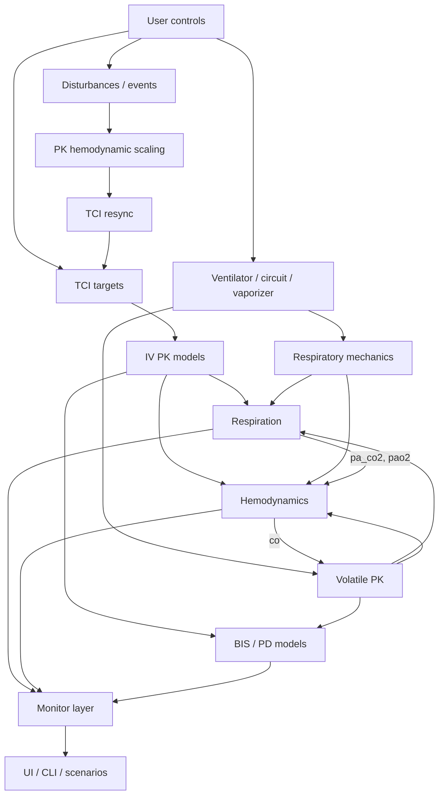

# Dependencies

See [Architecture](ARCHITECTURE.md#step-pipeline) for execution order and
[data ownership](ARCHITECTURE.md#data-ownership) for raw and displayed state.
This document covers dependencies that are less apparent from the runtime order.

## Dependency graph


```mermaid
flowchart TD
    USER[User controls] --> DIST[Disturbances / events]
    USER --> TCI[TCI targets]
    USER --> MACHINE[Ventilator / circuit / vaporizer]

    DIST --> PKSCALE[PK hemodynamic scaling]
    PKSCALE --> TCISYNC[TCI resync]
    TCISYNC --> TCI

    TCI --> PKIV[IV PK models]
    MACHINE --> PKVOL[Volatile PK]
    MACHINE --> MECH[Respiratory mechanics]

    PKIV --> RESP[Respiration]
    PKIV --> HEMO[Hemodynamics]
    PKIV --> BIS[BIS / PD models]
    PKVOL --> RESP
    PKVOL --> HEMO
    PKVOL --> BIS

    MECH --> RESP
    MECH --> HEMO
    RESP -->|pa_co2, pao2| HEMO
    HEMO -->|co| PKVOL

    RESP --> MON[Monitor layer]
    HEMO --> MON
    BIS --> MON
    MON --> UI[UI / CLI / scenarios]
```

## Inputs by subsystem

### Hemodynamics

| Source | Data | Notes |
|--------|------|-------|
| PK Propofol | `propofol_cp` | Vasodilation, cardiac depression |
| PK Remifentanil | `remi_cp` | Bradycardia, vasodilation |
| Vasopressor PK | `nore_ce`, `epi_ce`, `phenyl_ce`, `vaso_ce`, `dobu_ce`, `mil_ce` | Vasoconstriction, inotropy, lusitropy |
| Volatile PK | `mac_sevo` | Cardiovascular depression |
| Resp mechanics | `pit`, `peep_cmH2O` | Preload and pulmonary coupling |
| Respiration | `pa_co2`, `pao2` | Chemoreflex and hypoxia effects |
| Disturbances | `d_hr`, `d_sv`, `d_svr` | Surgical stimulation |

### Respiration

| Source | Data | Notes |
|--------|------|-------|
| PK Propofol | `propofol_ce` | Depresses central drive |
| PK Remifentanil | `remi_ce` | Depresses drive and CO2 response |
| PK Rocuronium | `roc_ce` | Reduces muscle factor |
| Volatile PK | `mac_sevo` | Depresses ventilatory control |
| Resp mechanics | delivered VT, mean Paw, PEEP | Assisted ventilation and oxygenation |
| Hemodynamics | `co` (from prior step) | Influences perfusion-sensitive EtCO2 behavior |
| Thermal/shivering | metabolic factor, shiver level | Alters VCO2 and O2 demand |

### Monitor layer receives

| Source | Data | Notes |
|--------|------|-------|
| Hemodynamics | raw `map/hr/sbp/dbp` | Used to synthesize display numerics |
| Respiration | raw `etco2`, `sao2` | Used to synthesize capno and pulse-ox behavior |
| BIS / TOF / LOC | raw model outputs | Displayed and alarmed values |
| Monitor settings | arterial line enabled, NIBP interval | Changes presentation mode |

## One-step lag cases

A few execution-order lags are part of the model contract:

| Value | Used by | Updated by | Reason |
|------|---------|------------|--------|
| `state.co` | Volatile PK scaling and respiration perfusion effects | Hemodynamics | CO is computed after PK and respiration in the same step |
| `state.va` | Volatile PK | Respiration | Alveolar ventilation is computed after machine and PK setup |
| `state.mv` | Circuit / machine context | Physiology | Minute ventilation is finalized after mechanics and respiration |

These lags are small at the intended simulation time steps and preserve the intended physiology execution order.

## State synchronization examples

```text
pk_prop.state.ce      -> state.propofol_ce
pk_prop.state.c1      -> state.propofol_cp
pk_remi.state.ce      -> state.remi_ce
pk_remi.state.c1      -> state.remi_cp
resp_state.pa_co2     -> state.pa_co2
resp_state.p_alveolar_co2 -> state.alveolar_co2
hemo_state.map        -> state.map
hemo_state.map        -> state.display_map   (via monitor layer)
spo2_monitor output   -> state.spo2
spo2_monitor output   -> state.display_spo2
```
