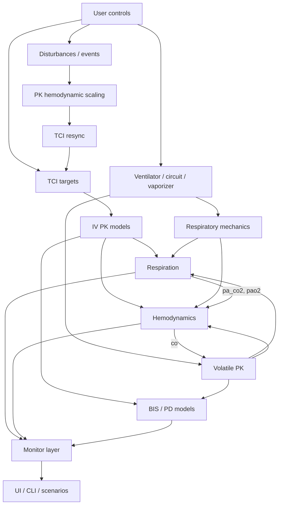

# Dependencies

## Execution Order

Each `SimulationEngine.step()` executes subsystems in this order:

```text
1. Disturbances    -> Surgical stimulation, bleeding, fluids, sepsis, anaphylaxis
2. PK scaling      -> Live PK volumes/clearances updated from blood volume + CO
3. TCI sync        -> Active controllers resynced/rebuilt against the live PK model
4. TCI controllers -> Drug target -> infusion rate calculation
5. Machine         -> Ventilator, bag-mask, vaporizer, circuit (O2/Air/N2O)
6. PK models       -> Drug concentrations (Ce, Cp) updated
7. Physiology      -> Resp mechanics -> Respiration -> Hemodynamics
8. Projection      -> Live subsystem state copied into SimulationState
9. Monitors        -> Waveforms, display_* numerics, alarms, NIBP
10. Shivering      -> Thermoregulatory metabolic load
11. Temperature    -> Core temperature and redistribution
12. Death detector -> Viability check using raw hemodynamics
```

## Raw vs Display Ownership

| Writer | Fields owned | Primary consumers |
|-------|--------------|-------------------|
| `projection.sync_pk_state()` | `propofol_ce/cp`, `remi_ce/cp`, vasoactive `*_ce` | Physiology, PD models, recorder |
| `projection.project_runtime_physiology()` | `map`, `hr`, `sbp`, `dbp`, `co`, `sv`, `svr`, `rr`, `vt`, `mv`, `va`, `etco2`, `pa_co2`, `alveolar_co2`, `pao2`, `sao2` | Recorder, internal logic, analytics, physiology tests |
| `monitors.step_monitors()` | `display_map`, `display_hr`, `display_sbp`, `display_dbp`, `display_bis`, `display_etco2`, `display_spo2`, waveforms, alarms | UI, CLI, tutorial/scenario checks |

The monitor layer must not overwrite raw arterial pressure or heart rate.

## Dependency Graph


```mermaid
flowchart TD
    USER[User controls] --> DIST[Disturbances / events]
    USER --> TCI[TCI targets]
    USER --> MACHINE[Ventilator / circuit / vaporizer]

    DIST --> PKSCALE[PK hemodynamic scaling]
    PKSCALE --> TCISYNC[TCI resync]
    TCISYNC --> TCI

    TCI --> PKIV[IV PK models]
    MACHINE --> PKVOL[Volatile PK]
    MACHINE --> MECH[Respiratory mechanics]

    PKIV --> RESP[Respiration]
    PKIV --> HEMO[Hemodynamics]
    PKIV --> BIS[BIS / PD models]
    PKVOL --> RESP
    PKVOL --> HEMO
    PKVOL --> BIS

    MECH --> RESP
    MECH --> HEMO
    RESP -->|pa_co2, pao2| HEMO
    HEMO -->|co| PKVOL

    RESP --> MON[Monitor layer]
    HEMO --> MON
    BIS --> MON
    MON --> UI[UI / CLI / scenarios]
```

## Key Inputs Per Subsystem

### Hemodynamics receives

| Source | Data | Notes |
|--------|------|-------|
| PK Propofol | `propofol_ce` | Vasodilation, cardiac depression |
| PK Remifentanil | `remi_ce` | Bradycardia, vasodilation |
| Vasopressor PK | `nore_ce`, `epi_ce`, `phenyl_ce`, `vaso_ce`, `dobu_ce`, `mil_ce` | Vasoconstriction, inotropy, lusitropy |
| Volatile PK | `mac_sevo` | Cardiovascular depression |
| Resp mechanics | `pit`, `peep_cmH2O` | Preload and pulmonary coupling |
| Respiration | `pa_co2`, `pao2` | Chemoreflex and hypoxia effects |
| Disturbances | `d_hr`, `d_sv`, `d_svr` | Surgical stimulation |

### Respiration receives

| Source | Data | Notes |
|--------|------|-------|
| PK Propofol | `propofol_ce` | Depresses central drive |
| PK Remifentanil | `remi_ce` | Depresses drive and CO2 response |
| PK Rocuronium | `roc_ce` | Reduces muscle factor |
| Volatile PK | `mac_sevo` | Depresses ventilatory control |
| Resp mechanics | delivered VT, mean Paw, PEEP | Assisted ventilation and oxygenation |
| Hemodynamics | `co` (from prior step) | Influences perfusion-sensitive EtCO2 behavior |
| Thermal/shivering | metabolic factor, shiver level | Alters VCO2 and O2 demand |

### Monitor layer receives

| Source | Data | Notes |
|--------|------|-------|
| Hemodynamics | raw `map/hr/sbp/dbp` | Used to synthesize display numerics |
| Respiration | raw `etco2`, `sao2` | Used to synthesize capno and pulse-ox behavior |
| BIS / TOF / LOC | raw model outputs | Displayed and alarmed values |
| Monitor settings | arterial line enabled, NIBP interval | Changes presentation mode |

## Remaining One-Step Lag Cases

The raw/display refactor removed step-size-dependent monitor lag as a semantic issue, but a few execution-order lags remain:

| Value | Used by | Updated by | Reason |
|------|---------|------------|--------|
| `state.co` | Volatile PK scaling and respiration perfusion effects | Hemodynamics | CO is updated after PK and respiration in the same step |
| `state.va` | Volatile PK | Respiration | Alveolar ventilation is computed after machine and PK setup |
| `state.mv` | Circuit / machine context | Physiology | Minute ventilation is finalized after mechanics and respiration |

These lags are small at the intended simulation time steps and are preferable to reordering core physiology for now.

## State Synchronization Examples

```text
pk_prop.state.ce      -> state.propofol_ce
resp_state.pa_co2     -> state.pa_co2
resp_state.p_alveolar_co2 -> state.alveolar_co2
hemo_state.map        -> state.map
hemo_state.map        -> state.display_map   (via monitor layer)
spo2_monitor output   -> state.spo2
spo2_monitor output   -> state.display_spo2
```
