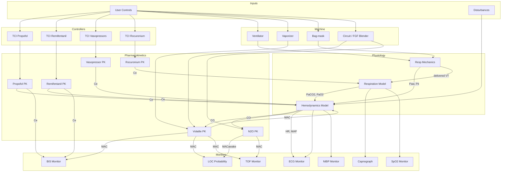

# Dependencies

## Execution Order (engine.step)

Each simulation step executes subsystems in this order:

```
1. Disturbances    → Surgical stimulation, user events
2. TCI Controllers → Drug target → infusion rate calculation (synced to sim time)
3. Machine         → Ventilator, bag-mask, vaporizer, circuit (O2/Air/N2O)
4. PK Models       → Drug concentrations (Ce, Cp) updated
5. Physiology      → Resp Mechanics (assisted only) → Respiration → Hemodynamics
6. Monitors        → Waveforms, displayed values
7. Shivering       → Thermoregulatory heat/metabolic load
8. Temperature     → Core temp, redistribution
9. Death Detector  → Viability check
```

## Data Flow Diagram



## Key Dependencies

### Hemodynamics receives from:
| Source | Data | Notes |
|--------|------|-------|
| PK Propofol | Ce | Vasodilation, cardiac depression |
| PK Remifentanil | Ce | Bradycardia, vasodilation |
| PK Vasopressors | Ce (Nore, Epi, Phenyl) | Vasoconstriction, inotropy |
| Volatile PK | Sevo MAC | Vasodilation, cardiac depression (N2O not modeled in hemo) |
| Resp Mechanics | Pit (intrathoracic) | Preload reduction with assisted ventilation/PEEP |
| Respiration | PaCO2, PaO2 | Chemoreflex effects |
| Disturbances | d_hr, d_sv, d_tpr | Surgical stimulation |

### Respiration receives from:
| Source | Data | Notes |
|--------|------|-------|
| PK Propofol | Ce | Respiratory depression |
| PK Remifentanil | Ce | Respiratory depression |
| PK Rocuronium | Ce | Muscle paralysis |
| Volatile PK | Sevo MAC | Respiratory depression (N2O not modeled in drive) |
| Mechanics | Paw, delivered VT | Assisted ventilation only (ventilator or bag-mask) |
| Shivering | Intensity | Raises metabolic load (CO2/O2) |

### BIS receives from:
| Source | Data | Notes |
|--------|------|-------|
| PK Propofol | Ce | Primary hypnotic |
| PK Remifentanil | Ce | Synergistic interaction |
| Volatile PK | Sevo MAC | Volatile contribution (N2O has minimal BIS effect) |

### LOC receives from:
| Source | Data | Notes |
|--------|------|-------|
| PK Propofol | Ce | Primary hypnotic |
| PK Remifentanil | Ce | Synergistic interaction |
| Volatile PK | Sevo MAC + N2O MACawake | Inhaled contribution |

### TOF receives from:
| Source | Data | Notes |
|--------|------|-------|
| PK Rocuronium | Ce | NMBA effect |
| Volatile PK | Sevo MAC + N2O MAC | Potentiation of NMBA |

## Monitoring Modes

- Arterial line enabled: ABP waveform and continuous SBP/DBP/MAP are displayed.
- Arterial line disabled: ABP panel is hidden and NIBP cuff values are displayed instead.

## One-Step Lag Cases

The following values have a one-step lag due to execution order:

| Value | Used By | Updated By | Lag Reason |
|-------|---------|------------|------------|
| `state.co` | Volatile PK | Hemodynamics | CO affects uptake, but hemo runs after PK |
| `state.mv` | Circuit mixing | Physiology | MV is computed after machine step |
| `state.va` | Volatile PK | Respiration | VA is computed after PK |
| `hemo.dist_svr` | Hemodynamics | Calculated at step start | Disturbance applied before hemo calculation |

These lags are acceptable at typical dt (0.5s) as physiological changes are slower than simulation steps.

## State Synchronization

State flows: **Subsystems → Engine State** (see `_sync_pk_state()`)

```
pk_prop.state.ce  ──→  engine.state.propofol_ce
pk_remi.state.ce  ──→  engine.state.remi_ce
hemo.state.map    ──→  engine.state.map
resp.state.rr     ──→  engine.state.rr
```

This happens at fixed points in `step()`, documented in `SimulationEngine` class docstring.
